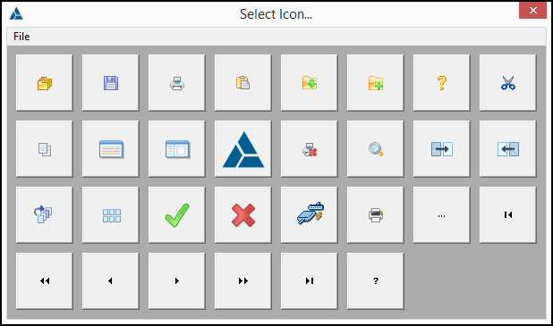

# ctIconPicker #

### Icon Picker Class written in and for Clarion for Windows ###

## License ##
Distributed under the [MIT License](https://opensource.org/licenses/MIT).

## Overview ##

In some of our applications we allowed the user to create 'user-defined' buttons to call their favorite programs, WORD.EXE e.g.  ctIconPicker is a class we developed to allow the user to associate an icon resources with their buttons.

The class provides an example of using PROCTYPE and the Windows [EnumResourceNames](https://msdn.microsoft.com/en-us/library/windows/desktop/ms648037(v=vs.85).aspx "EnumResourceNames function") function which takes a FUNCTION as one of its parameters.

### Screen Shot ###

### Source Files ###

The ctIconPicker source code should be installed to the Clarion \accessory\libsrc\win folder. The ctIconPicker source code and its respective components are contained in:

 
 **ctIconPicker.inc** ctIconPicker declarations
 
 **ctIconPicker.clw** ctIconPicker method definitions
 
### Conceptual Example ###

       PROGRAM
    
       MAP
       END
      
       INCLUDE('ctIconPicker.inc'),ONCE
       
    Window WINDOW('ctIconPicker Test'),AT(,,360,280),CENTER,GRAY,SYSTEM
              PROMPT('Resource Name'),AT(10,10),USE(?ResourceNamePrompt)
              ENTRY(@S255),AT(65,9,240),USE(szResourceName),DISABLE,FLAT
              BUTTON('Select Icon ...'),AT(140,26,80,32),USE(?ExampleButton),LEFT
           END
    
      CODE
         OPEN(Window)
         ACCEPT
            CASE EVENT()
              OF EVENT:OpenWindow
                 thisIconPicker.Init(8, 32, 32, 5)
    
             OF EVENT:CloseWindow
                CLOSE(Window)
                BREAK
    
             OF EVENT:Accepted   
                CASE FIELD()
                  OF ?ExampleButton
                     ?ExampleButton{PROP:ICON} = thisIconPicker.Ask()
                END   
            END 
       END
    RETURN

Please see the IconPicker example for a more details.

## Documentation ##

### [Properties](http://devuna.github.io/ctIconPickerProperty) ###

### [Methods](http://devuna.github.io/ctIconPickerMethod) ###

## Release Notes ##
1. June 11, 2017 - README.md updated 
2. June 10, 2017 - ctIconPicker Initial Public Release 

